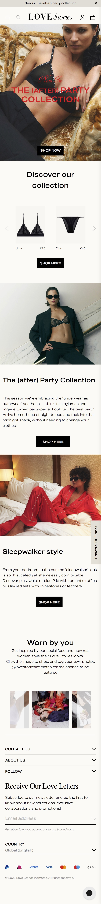
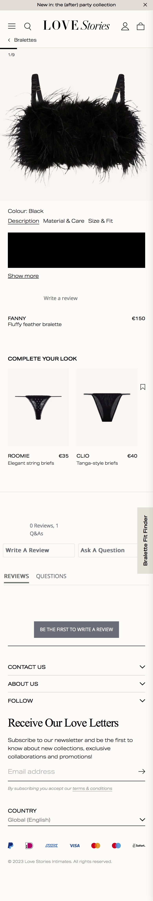
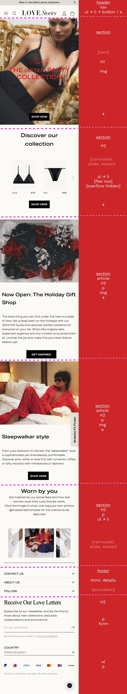
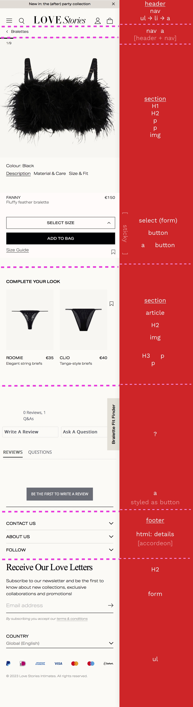
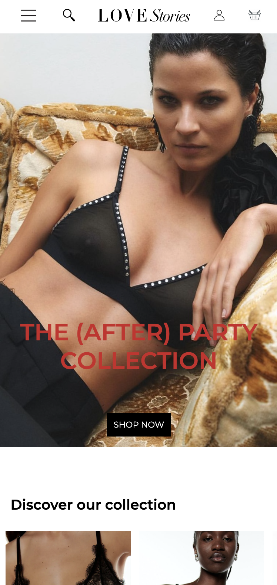
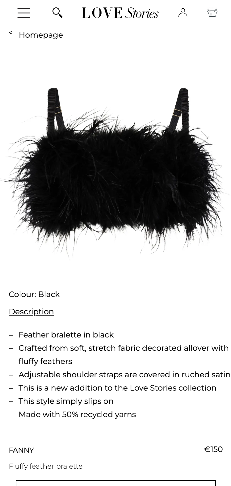

# Procesverslag
Markdown is een simpele manier om HTML te schrijven.  
Markdown cheat cheet: [Hulp bij het schrijven van Markdown](https://github.com/adam-p/markdown-here/wiki/Markdown-Cheatsheet).

Nb. De standaardstructuur en de spartaanse opmaak van de README.md zijn helemaal prima. Het gaat om de inhoud van je procesverslag. Besteedt de tijd voor pracht en praal aan je website.

Nb. Door *open* toe te voegen aan een *details* element kun je deze standaard open zetten. Fijn om dat steeds voor de relevante stuk(ken) te doen.

## Jij

  
uitwerken voor kick-off werkgroep

  ### Auteur:
  Tamara Schukking

  #### Je startniveau:
  Blauw 

  #### Je focus:
  Surface Plane
 

## Je website

  
uitwerken voor kick-off werkgroep

  ### Je opdracht:
  https://lovestoriesintimates.com/en/

  #### Screenshot(s) van de eerste pagina (small screen): 
  Homepage
  

  #### Screenshot(s) van de tweede pagina (small screen):
  Productpagina 
  
 

## Toegankelijkheidstest 1/2 (week 1)

  
uitwerken na test in 2e werkgroep

  ### Bevindingen
  Lijst met je bevindingen die in de test naar voren kwamen:
  De foto's hebben geen alt-tekst, er zijn meerdere links waarvan de alt-tekst niet meer klopt met wat er nu in de link staat. Verder ga je best chill door het menu heen en geeft hij elk kopje aan en zegt vervolgens hoeveel dingen er in de lijst staan en noemt die per stuk op.

## Breakdownschets (week 1)

  
uitwerken na afloop 3e werkgroep

  ### de eerste pagina: 
  

  ### de tweede pagina
  

## Voortgang 1 (week 2)

  
uitwerken voor 1e voortgang

  ### Stand van zaken
  Ik heb voor nu de prioriteit gegooid op het uitwerken van mijn breakdownschets voor de homepagina,
  deze wilde ik perfect hebben zodat ik mijn HTML snel en makkelijk kon maken.

  ### Verslag van meeting
  Quinten heeft geholpen en gekeken naar mijn breakdownschets en aangegeven wat veranderd moest.

## Voortgang 2 (week 3)

  
uitwerken voor 2e voortgang

  ### Stand van zaken
  Ik heb voor nu de prioriteit gegooid op het uitwerken van mijn breakdownschets voor de productpagina,
  deze wilde ik perfect hebben zodat ik mijn tweede HTML snel en makkelijk kon maken.

  ### Verslag van meeting
  Quinten en Tristan (klasgenoot) hebben geholpen en gekeken naar mijn breakdownschets en aangegeven wat veranderd moest.

## Toegankelijkheidstest 2/2 (week 4)

  
uitwerken na test in 9e werkgroep

  ### BEVINDINGEN
  # Contrast:
  Het contrast op mijn volledige pagina was helemaal goed, dit omdat ik eigenlijk meerendeels gebruik maak van zwart en wit.
  Wel is de rode tekst in de hero slecht leesbaar, dit heb ik in mijn ontwerp niet aangepast omdat dat niet werkte met de productfoto erachter.
  Als ik dit had uitgewerkt had ik er een witte background aan toegevoegd die als een banner over de pagina heen zou lopen,
  evt met een transparantie van 80% om de foto nog zichtbaar te houden.

  # ALT-Tekst:
  Ik heb alle alt-tekst op mijn website doorlopen en elke foto voorzien van een duidelijke beschrijving voor blinden en slechtziende.

  # Screenreader:
  Ik ben samen met Marten door de website getabt met de screenreader en alles werdt hier duidelijk en goed voorgelezen door de screenreader.

## Voortgang 3 (week 4)

  
uitwerken voor 3e voortgang

  ### Stand van zaken
  In het laatste voortgangsgesprek heb ik met Marten gezeten,
  vooral om te kijken naar verschillende stukjes uit mijn code.
  Hier was ik nog niet begonnen aan mijn tweede (product) pagina, dus deze heeft helaas de
  voortgangsgesprekken niet gehaald.

  ### Verslag van meeting
  hier na afloop snel de uitkomsten van de meeting vastleggen

  - De zwarte buttons waren alleen een <a>, en heb ik samen met Marten een 
 om gezet zodat ik deze
  makkelijker/beter kon stylen.
  - Verder nog verschillende kleine aanpassingen gedaan.

## Eindgesprek (week 5)

  
uitwerken voor eindgesprek

  ### Je uitkomst - karakteristiek screenshots:
  
  

  ### Dit ging goed/Heb ik geleerd: 
  Ik ben oprecht trots dat ik naast mijn drukke schema en het vele uitstellen echt wel trots ben op mijn eindresultaat,
  ik heb het idee dat ik, na dik een jaar niks aan code gedaan te hebben, echt veel zelf heb op kunnen lossen met minimale hulp.
  Uiteindelijk met mijn laatste pagina wat hulp gehad van wat programmeer vrienden en studentassistenten, waar ik het niet zonder heb kunnen doen.

  ### Dit was lastig/Is niet gelukt:
  Ik heb nog een klein lijstje met dingen die niet zijn gelukt:
  - hover op img's toevoegen.
  - 2 zij-img's in header naar zijkant 'duwen'.
  - breadcrumb arrow alignen met de tekst.
  - 'material & care' + 'size & fit' toevoegen bij de product beschrijving.

## Bronnenlijst

  
continu bijhouden terwijl je werkt

  1. ChatGTP:
    - mijn scheidingslijn in m'n html.
    - erachter gekomen dat ik in m'n button gewoon kan typen en er geen 
 element in hoeft te staan.
  2. CodePen:
    - alleen de hamburgermenu opdracht gebruikt.
  3. Student(assistent)en:
    - Quinten Kok:  geholpen met de h1 in de hero
    - Tristan Brattinga:  geholpen met formulier
    - Pip Harsveld:  geholpen met m'n carroussel
    - Bahaa Salaymeh:  geholpen met hamburgermenu
    - Christian Donker:  geholpen met winkelmand js, m'n easter egg & overall bugfixes

